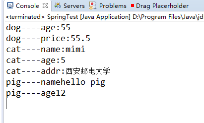

# MySpring
实现了简单的Spring的DI
## 主要步骤
* 使用dom4j读入ApplicationContext.xml文件的内容，将信息存入Map<String,Bean> beanConfig中，将配置文件中的id作为Map中的key,value为配置文件中的bean对应的id、class、和property

* 实现接口BeanFactory中的getBean（String id）方法，该方法首先判断Map<String, Object> beanContext容器中是否有id对应的实例，如果没有则创建bean并返回，反之直接会返回


* 创建bean时先在信息容器beanConfig中根据id找到从配置文件中读取到的bean对应的信息，然后使用反射机制中的Class.forName(类的全路径)方法生成Class，接着使用newInstance()方法得到对象的实例，然后根据bean对应的propert的name值找到该类的set方法，最后调用method.invoke(对象的实例，参数列表)设置属性值，如果配置文件中的value值为空且ref值不为空，此时递归的先实例ref引用的实例
## 实现的效果
* 配置文件
```
<?xml version="1.0" encoding="UTF-8"?>
<beans>
	<bean id="pig" class="test.Pig">
		<property name="name" value="hello pig"></property>
		<property name="age" value="12"></property>
	</bean>
	<bean id="mydog" class="test.Dog">
		<property name="age" value="55"></property>
		<property name="price" value="55.5"></property>
		<property name="cat" ref="mycat"></property>
	</bean>
	<bean id="mycat" class="test.Cat">
		<property name="name" value="mimi"></property>
		<property name="age" value="5"></property>
		<property name="addr" value="西安邮电大学"></property>
		<property name="pig" ref="pig"></property>
	</bean>
</beans>
```
* 测试代码
```java
package test;

import srping.BeanFactory;
import srping.ClassPathXmlApplicationContext;

public class SpringTest {
	public static void main(String[] args) {
		BeanFactory factory=new ClassPathXmlApplicationContext("ApplicationContext.xml");
		Dog dog=(Dog)factory.getBean("mydog");
		System.out.println("dog----age:"+dog.getAge());
		System.out.println("dog----price:"+dog.getPrice());
		System.out.println("cat----name:"+dog.getCat().getName());
		System.out.println("cat----age:"+dog.getCat().getAge());
		System.out.println("cat----addr:"+dog.getCat().getAddr());
		System.out.println("pig----name"+dog.getCat().getPig().getName());
		System.out.println("pig----age"+dog.getCat().getPig().getAge());
	}
}

```
* 测试结果


